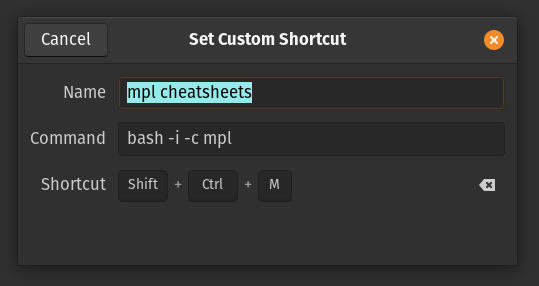

## Error of the Week
I found these [handy shortcut cheatsheets for matplotlib](https://github.com/matplotlib/cheatsheets). Even though I work with it almost everyday I find myself constantly looking up stuff. Switching into the web to search is distracting to my workflow. 

I added them as a bash alias first in case I want to access them from the terminal 

```
alias mpl='feh ~/matplotlibCheatSheet.png -. & feh ~/matplotlibCheatSheet2.png -.'

```
* you may need to download feh, slap a `sudo apt install` on it.
The `.-` downsizes it from full screen. Should work on tiling as well.


If you really wanted to do this the proper way you could write a script to fetch updates from  the github repo then recompile the filed and display it but I just downloaded the pdfs. I might do that later if I keep using this. 

Then add a keyboard shortcut. 

