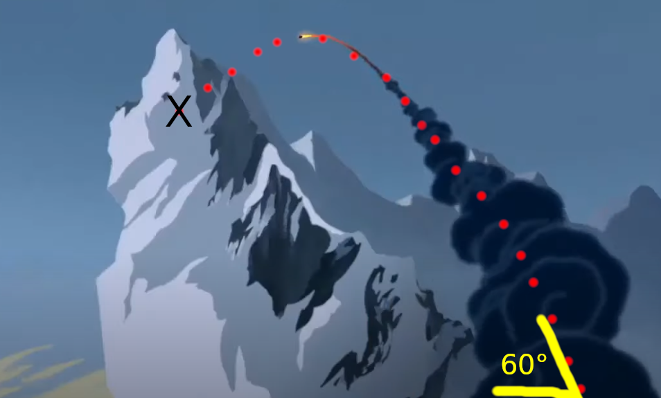

In "honor" of the recent Mulan remake, I present to you my analysis of the Mulan snow avalance scene. We will look at the physics of snow avalanches and make some simple deductions from the scene. 

Snow avalanches are a type of [gravity current](https://en.wikipedia.org/wiki/Gravity_current), a fluid which flows due to it negative buoyancy. Snow avalanches are complex multiphase hazards. They are multiphase since they can incorportate ice, water, and air. It gets complicated when snow acts both as a fluid and a solid as it flows.

It is difficult to comment on the multiphase aspects of the hun-destroying snow avalanche since it is an animated film. But we will do our best to put some numbers on this. 

First, let's find the top of the avalanche. 
We can use the baslistic trajectory of the canon to find how tall the top (relative to Mulan's position). 

The equation of projectile motion:

 *y(t) = -0.5gt2  + v0tsin(&theta;)*

where *y* is height in meters, *g* is gravity in ms-2, *t* is time in s, v0 is the initial velocity, and y0 is the initial height. 
The maximum height of the would be: 
*H= v02 sin2(&theta;)/(2g)*

What is the initial velocity of one of these early canons? That seems like a problem *mysterious as the dark side of the moon.* 

We can make some guesses. First off, it was probably extremely variable in the past. Gunpowder weapons were extremely finicky and difficult to work with. But looking at the scene from "Make a Man Out of You" we can see what could be the intial velocity. The rocket used in the movie (called a canon) was based on a [huolongchushi](https://en.wikipedia.org/wiki/Huolongchushui). It was hard to find much about these weapons velocity but some [similar weapons](https://deadliestwarrior.fandom.com/wiki/Nest_of_Bees) had velocities of up to 150 m/s. So if we use a conservative guess of 100 m/s and the 60 degree angle, we end up with a height of 375 m which rounds to 500 m. 

From here I want to find the volume of snow and ice that then becomes the avalance. We can see in this image the change in the mountain side. If only we had INSAR back then. 

So it looks like just the snow and ice situated on the precarious slopes of the mountain sloughs off. Let's call that 1/10 of the volume of the cone. 

I would say it is taller than it is wide and estimate the base near the huns to be 200 m. So using the volume of a cone, we can get a volume of 30,000 m3. Compared to other avalanches, this would be classified as a *large avalanche*. 

Acording to the [European Avalance Warning Services](https://www.avalanches.org/standards/avalanche-size/) an avalanche of this size: 

>May bury and destroy cars, damage trucks, destroy small buildings and break a few trees.
>When skiers are caught by avalanches of this size, probability for severe consequences are very high.

**BONUS:** 
*What is Mulan's kill count? Is it really the highest of all Disney heros?*
I used ImageJ to count that at this point there are 500 huns bearing down on them. Let's round to 1000 since there are some still coming over the hill. 

