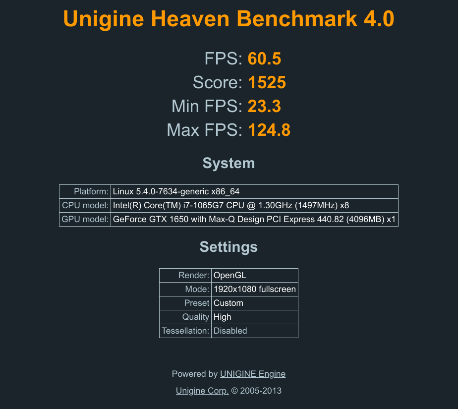

Honestly, I expected this post to be much longer. I expected it to be filled with issues then obscure solutions from Stack Exchange. But the process of installing Pop_OS! alongside Windows 10 was suprisingly simple. 

For many years an Ubuntu sole boot has been my daily driver. But when my computer's harddrive began to fail, I decided to upgrade to the Razer Blade Stealth. 

As you can see, the dGPU in this set up has a history of causing major linux-related headaches.

I choose Pop_OS! as my new distro since:
* It is based on Ubuntu 
* It comes with the Nvidia drivers pre-installed 
* Graphics switching is part of the operating system
* It is well maintained.

I was originally going to give up on Windows completely but I decided that it could helpful to have access to Windows solely for Adobe Creative Cloud. 

Here is my process:

1. Create Pop_OS! Boot Drive 

    Download [Pop_OS! iso](https://pop.system76.com/). Make sure you choose the version with the Nvidia drivers pre-installed. 

    Then I installed [Rufus](https://rufus.ie/) which I used to create a Pop_OS! boot drive. Rufus can also create a windows boot drive for Step 1.

    

    Select you device (some flash drive, usually greater than 8GB). Select .iso file. Partition scheme can be MBR or GPT.

    Run. 

    While you are at it I highly recommend making a Windows boot drive just in case you accidentally delete your Windows partition. Happens more often than you would think. 

2. Turn off Secure Boot 

    In order to load Pop_OS! you will have to disable UEFI secure boot in the BIOS. Isn't that * *gasp* *  *unsecure*?

    UEFI Secure Boot ensures that code loaded during the boot process is from trusted sources by identifying it by some cryptographic keys. Microsoft *signs* its software with certain keys so that the firmware knows it is Microsoft. And we trust Microsoft!

    In many linux systems the drivers are not signed and come from various sources. So with Secure Boot enabled drivers for important things say the graphics card or the trackpad will not load and they will be unusable. 

    For the purpose of a painless install of Pop_OS!, you can turn it off. 

    Turning this off allows us to boot software that isn't signed**.

    To do this reboot and as you are rebooting, you need to press *F1+del* to get into the BIOS menu. 

    In the BIOS use the arrow keys to navigate to **Security**.

    Go down to the bottom and enter *Secure Boot* 

    Select *Disabled*. 

    

    *Esc* and save settings.

3. Enter boot menu.

    Plug in your boot drive. 

    To enter the boot menu press *F12* during start up. 

    You will see the options you have to boot your computer.  One will be the harddrive with Windows on it and one will be the the Pop_OS! live flash drive.
    
    Boot from the flash drive. This will load a Live verson of Pop_OS!. 

4. Install Pop_OS!

    This generally gives you two options, install or try out.

    This video is a great walk through of the whole installation process. 

    

    Pay special attention to the portion dealing with [partioning the drive](https://youtu.be/CozK7sJ8UMs?t=705).

5. Shrink Windows Partiton

    Click on *Modify Partitions*.

    You have to first shrink the Windows Partition then create three new partitions for the Linux system. The Windows parition is generally the largest one.

    In the  *Edit* Menu, choose *Resize*. Resize and click *Apply*

    After resizing, you will have unallocated space. This will become the Linux partitons.

6. Add Linux partitons 

    Go back to *Modify Partitions*.

    Right click on unallocated space, click New. Give this partition 512 MiB. Change file system to **FAT32**. This will be your **boot partiton**. 

    Next, make the **swap** partition. Usually use RAM + 1GB or up to RAM*1.5. File system is **Linux Swap**. You may not need very much swap depending on your use case but try to have at least 4GB. I opted for a lot of swap. Read more about swap [here](https://opensource.com/article/18/9/swap-space-linux-systems).

    Create the parition where Pop_OS! lives, the **root partition** with the remaining space. File system **EXT4**. This should be the largest of your paritions.

    Apply. 

7. Finish install and check system 

    The rest of the install is very simple and should finish without a bump. There are several checks you should make now that Pop_OS! is installed. 

    * Connect to WiFi 
    * Play a video on speakers and headphones 
    * Text your built in microphone and any headphone microphone you might have. 
    * Switch between graphics cards. 

        

    Now check the boot to Windows. Restart your laptap and press *F12* during start up. Switch to Windows BootLoader in the Boot menu. 

Done! 

To prove it works despite the naysayers, here is a benchmark of the Razer Blade Stealth dGPU using Pop_OS!. I had to switch to Nvidia Graphics mode for it to utilize the dGPU and it would run on the iGPU in hybrid mode. 

** If you are especially worried about security/ if you are a shady and visit shady websites often, you can manually sign the kernals yourself and turn secure boot back on. If you are someone who uses the same password for multiple site, you don't have to worry about it. 

    

