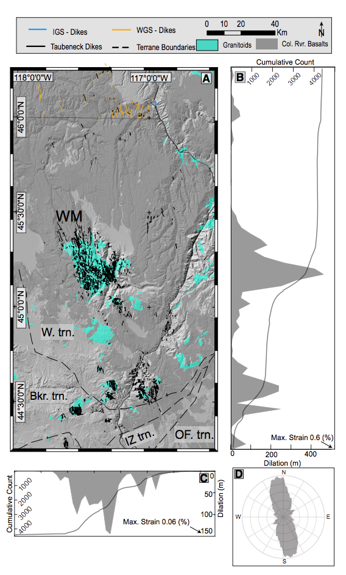

As part of the Spring 2020 Columbia River Basalt working group organized by Leif Karlstrom, we are investigating the linking and clustering of dikes based on two large datasets from the CRBs [[1]](#1) and Deccan Traps  [[2]](#2). 

*Figure from Morriss et al., 2020.*

<a id="1">[1]</a> 
Morriss, M. C., Karlstrom, L., Nasholds, M. W., & Wolff, J. A. (2020). The Chief Joseph dike swarm of the Columbia River flood basalts, and the legacy data set of William H. Taubeneck. Geosphere.

<a id="2">[2]</a> 
Indian Gelogic Survey Maps