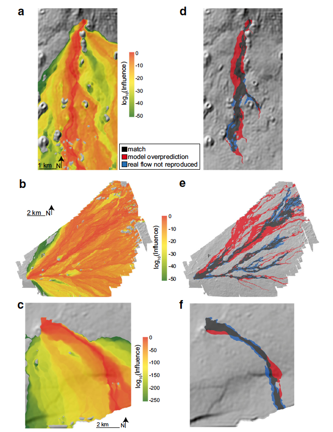

The prediction of lava flow inundation areas is critical for hazard mitigation around volcanic centers. Rheologic properties, initial conditions, and substrate properties all affect the spread, thickness, and length of a lava flow. Lava flows exhibit complex time-dependent rheology due to the presence of crystals and bubbles which changes throughout the solidification process.  Walker (1973) first proposed the relationship between effusion rate and length after observing that less viscous pahoehoe flows tended to be shorter than more viscous ‘a’a flows [[1]](#1). 

Substrate roughness slows the flow front velocity and increases the complexity of the flow morphology [[2]](#2). Additionally, background topography has an effect on the formation of lava channels within the main flow. Formation of channelized flow can significantly affect the supply of lava and cooling within the flow [[3]](#3). Isolating the role of substrate roughness from complex internal flow dynamics is a challenge for forecasting lava flow hazards. We apply MULTIFLOW (Richardson and Karlstrom, 2019) to explore how topography effects the resulting shape of the lava flow [[4]](#4). We posit that one first-order control on lava flow morphology is topography. Thus the shape of the lava flow reflects features of the background topography such as background slope and roughness. 

*Figure from Richardson & Karlstrom (2019)*

### References
<a id="1">[1]</a> 
Walker, G. (1973). Lengths of lava flows. Philosophical Transactions of the Royal Society, London, 274, 107–118.

<a id="2">[2]</a> 
Hamilton, C., Glaze, L., James, M., & Baloga, S. (2013). Topographic and stochastic influences on pāhoehoe lava lobe emplacement. Bulletin of Volcanology, 75(11), 1–16.

<a id="3">[3]</a> 
Richardson, P., & Karlstrom, L. (2019). The multi-scale influence of topography on lava flow morphology. Bulletin of Volcanology, 81(4), 1–42.

<a id="4">[4]</a> 
Dietterich, H., & Cashman, K. (2014). Channel networks within lava flows: Formation, evolution, and implications for flow behavior. Journal of Geophysical Research: Earth Surface, 119(8), 1704–1724.
