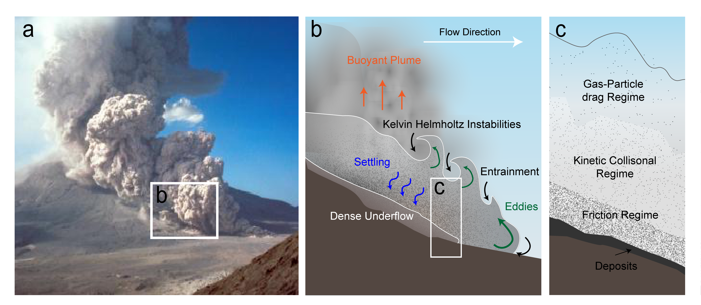
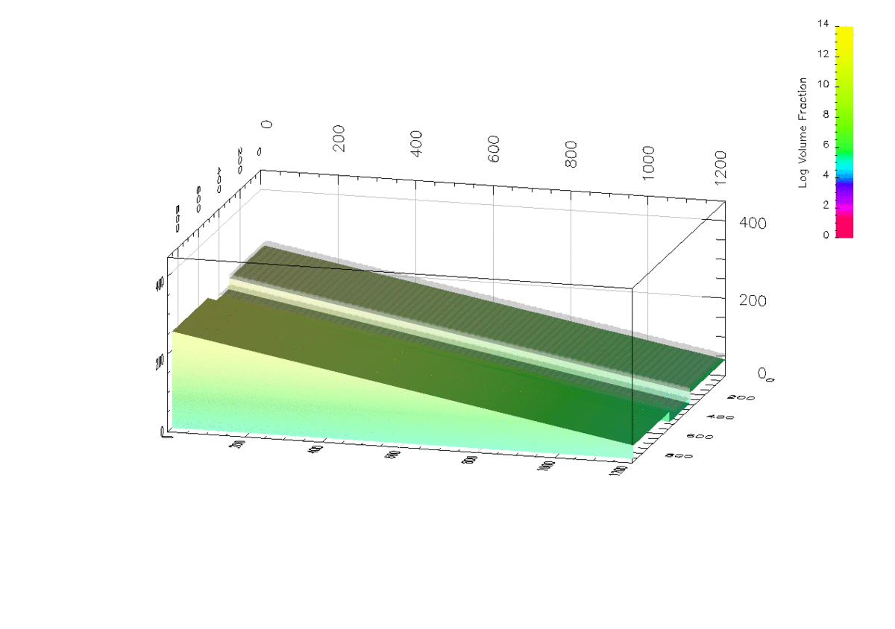

Pyroclastic density currents (PDCs) are highly mobile gravity currents produced by volcanic eruptions and have caused more fatalities than any other volcanic hazard [[1]](#1) . PDCs can have extreme runout distances traveling on order of hundreds of kilometers in large silicic eruptions and small-volume eruptions have been observed traveling on the order of tens of kilometers from initiation at a velocity of over 30 m/s [[2]](#2).   These flows are noteworthy for their ability to subsume terrain obstacles.

*Figure by Allison Kubo*

Inherent to PDCs are large vertical gradients of density, velocity, and dynamic pressure which complicate how they interact with the substrate they flow over. Recent eruptions have illustrated a complex view of how of PDCs interact with topography. Channelization of PDCs, in particular, has large effects on the runout distance and mobility of flows [[3]](#3)[[4]](#4).

In their relation to hazards and mobility, we are interested in how channelization of PDCs effects their thermal, density, and velocity structures. 

We apply multiphase numerical models [[5]](#5) 
to capture the vertical stratification of PDCs and model the effects of different channel geometries on the innundation area and velocity. 

**This work is *in prep*.**

<a id="1">[1]</a> 
Auker, M. R., Sparks, R. S. J., Siebert, L., Crosweller, H. S., & Ewert, J. (2013). A statistical analysis of the global historical volcanic fatalities record. JournalS of Applied Volcanology, S2(1), 2.
 

<a id="2">[2]</a> 
Branney, M. J., Kokelaar, P., & Kokelaar, B. P. (2002). Pyroclastic density currents and the sedimentation of ignimbrites. Geological Society of London.
  

<a id="3">[3]</a> 
Komorowski, J. C., Jenkins, S., Baxter, P. J., Picquout, A., Lavigne, F., Charbonnier, S., ... & Budi-Santoso, A. (2013). Paroxysmal dome explosion during the Merapi 2010 eruption: Processes and facies relationships of associated high-energy pyroclastic density currents. Journal of Volcanology and Geothermal Research, 261, 260-294.
  

<a id="4">[4]</a> 
Brand, B. D., Mackaman-Lofland, C., Pollock, N. M., Bendaña, S., Dawson, B., & Wichgers, P. (2014). Dynamics of pyroclastic density currents: Conditions that promote substrate erosion and self-channelization—Mount St Helens, Washington (USA). Journal of Volcanology and Geothermal Research, 276, 189-214.
  

<a id="5">[5]</a> 
Dufek, J., & Bergantz, G. W. (2007). Suspended load and bed-load transport of particle-laden gravity currents: the role of particle–bed interaction. Theoretical and Computational Fluid Dynamics, 21(2), 119-145.
